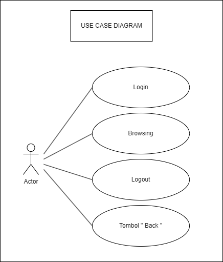
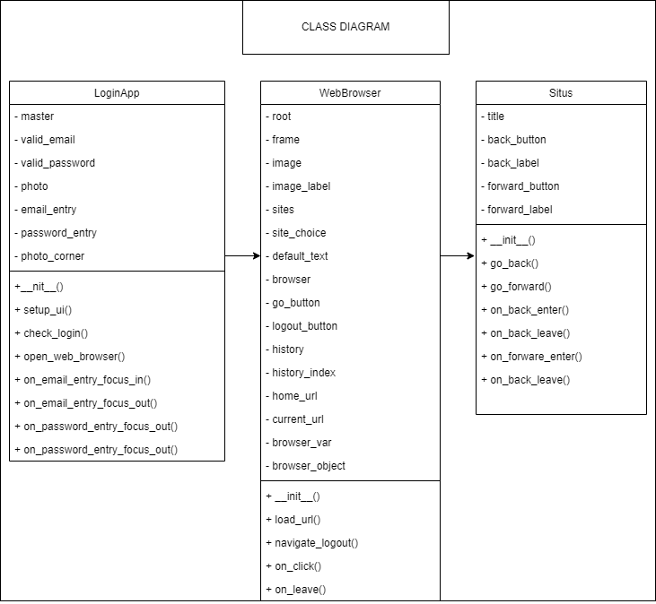

# Kelompok 2 (Web Browser App)
## Nama Anggota
1. Faila Nadhifatul Aryza (5302422008)
2. Rico Aji Dharma (5302422017)
3. Desy Sabati Ekawati (5302422036)
4. Ayu Ratna PPS (5302422037)

# Deskripsi
## a. Project
Project ini terdiri dari tiga file python, yaitu 1.py (LoginApp), 2.py(Web Browser), dan 3.py(Situs). Cara kerja file tersebut dimulai dari file 1.py yaitu user akan login terlebih dahulu, jika login sukses file akan berpindah dari file 1.py ke 2.py. Kemudian dari file 2.py user bisa melakukan browsing dengan 2 cara yaitu memilih di combobox atau menjelajahi situs lewat entry. Setelah memilih situs dan klik Go. User akan diarahkan ke file 3.py untuk menampilkan situs yang dipilih tadi
## b. Features
1. Login
2. Logout
3. Browsing (Pilih situs atau jelajahi situs)
4. Back

# UML Diagram
## a. Use Case Diagram

## b. Activity Diagram

## c. Class Diagram

## d. Sequence Diagram

